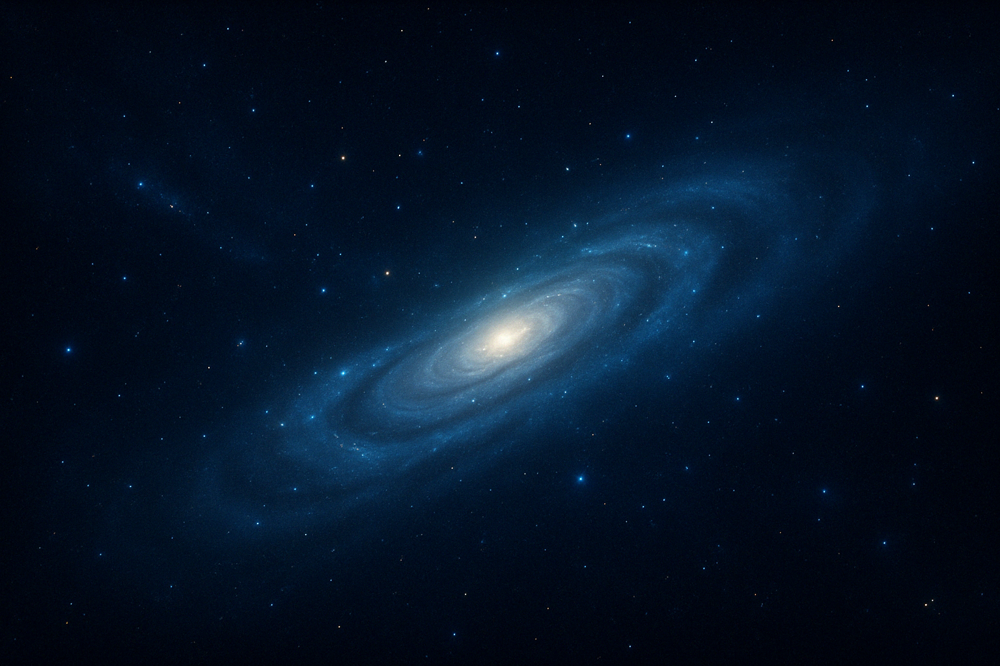

# 📄 GalaxyBackground.A.md

模組名稱（中文）: 宇宙背景圖  
模組名稱（英文）: GalaxyBackground  
副檔名: .A

屬於畫布: ADHDPlanet.C.md  
asset_type: main_visual_asset  
layer_order: visual  
interaction_type: none  
output_device: all  
動作描述: 作為整體背景使用，無互動功能

